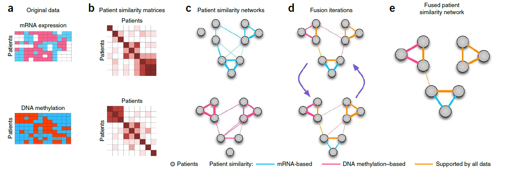

# Similarity Network Fusion
---
## Background
#### Overall
  - multiple and diverse **genome-scale data**
  - **integrative methods** are essential for capture biological information
  - identification of homogeneous **subtypes** in one cancer
#### Integrative challenge
 
 - the small number of **samples** compared to the large number of measurements.
 - the **differences** in scale, collection bias and noise in each data set
 - the **complementary nature** of the information provided by different types of data

#### Former methods
- **concatenate** normalized measurements
      *low signal-noise ratio*
- analyze each data type **independently** before combining
      *hard to integrate*
- **preselect** important genes and use Consensus Clustering
      *biased analysis*

## SNF
#### Main steps
- **construct** a sample-similarity network for each data type
- **integrate** these networks into a single similarity network using a nonlinear combination method

#### Advantages
- capture both **shared** and **complementary** information, offered insight into how informative each data type is to the observed similarity
- derive useful information from a **small** number of samples
- **robust** to noise, data heterogeneity and scales to a large number of genes
- make **efficient** identifies of subtypes among existing samples by clustering and predict labels for new samples
#### Details
- A **patient similarity network** is represented as a graph $G=(V,E)$  
  - $V = \{x_1, x_2, x_3, ..., x_n\}$ correspond to the patients  
  - $E$ similarity between patients
  - $W$ is the similarity matrix
  $$
  \begin{aligned}
  \rho(x_i, x_j) &= Euclidean \space distance \space  between \space  x_i \space and \space x_j  \\
  \epsilon_{i,j} &= \frac{mean(\rho(x_i, N_i)) + mean(\rho(x_j, N_j))+\rho(x_i, x_j)}{3} \\
  W(i, j) &= exp(-\frac{\rho^2(x_i,x_j)}{\mu\epsilon_{i,j}})
  \end{aligned}
  $$
- Define a full and sparse **kernel** to normalize weighted matrix on the vertex $V$
  - full kernel is a normalized weight matrix $P$
  $$
  \begin{aligned}
   P &= D^{-1}W \\
   D(i, i) &= \sum_{j}W(i,j) \\
   \sum_{j}P(i,j) &= 1
  \end{aligned}
  $$
  - a little modification to eliminate self-similarities
  $$
  \begin{aligned}
   P(i,j) &= \begin{cases}
   \frac{W(i,j)}{2\sum_{k\not ={i}}{W(i, k)}}, \small{j\not ={i}} \\
   \frac{1}{2}, \small{j=i}
   \end{cases}   
  \end{aligned}
  $$
- use KNN to measure local **affinity** (non-neighboring points)
  $$
  S(i,j) = \begin{cases}
  \frac{W(i,j)}{\sum_{k\in{N_i}W(i,k)}}, \small{j\in{N_i}} \\
  0, \small{otherwise}
  \end{cases}
  $$