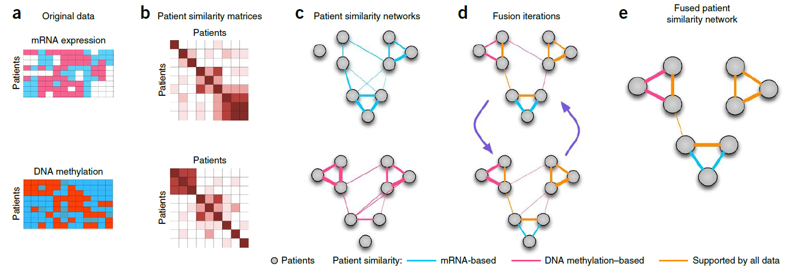
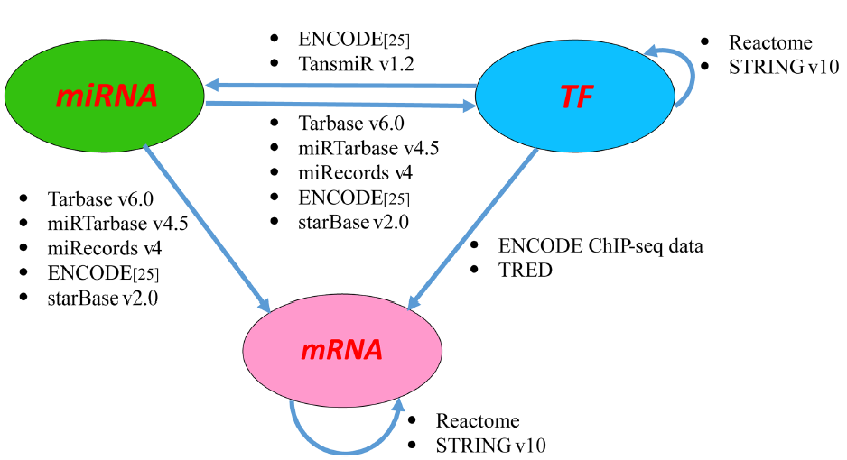
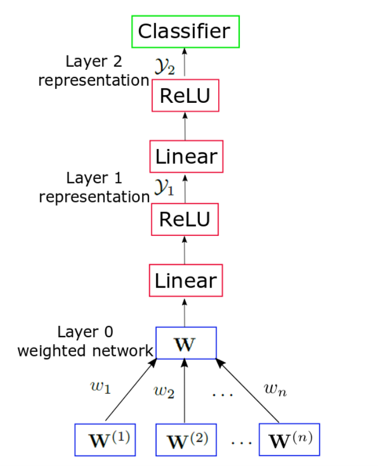
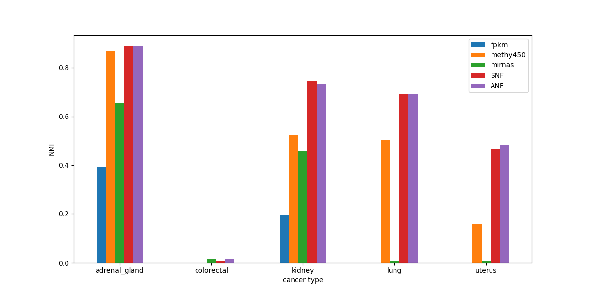
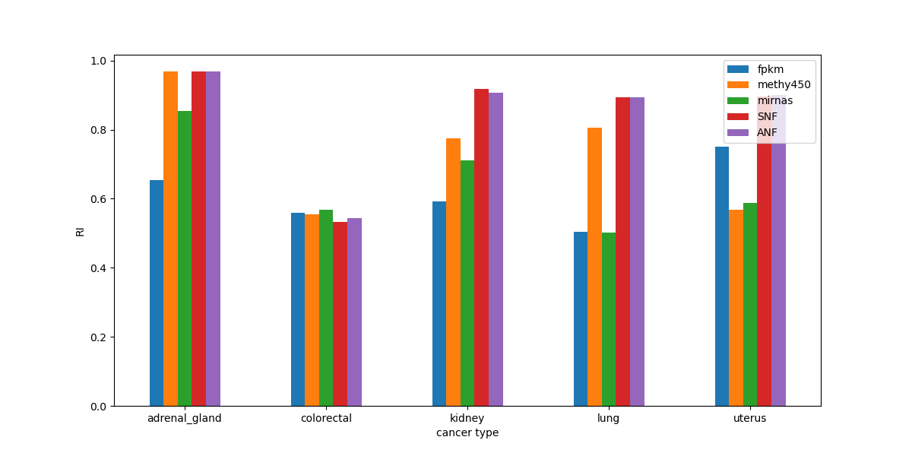
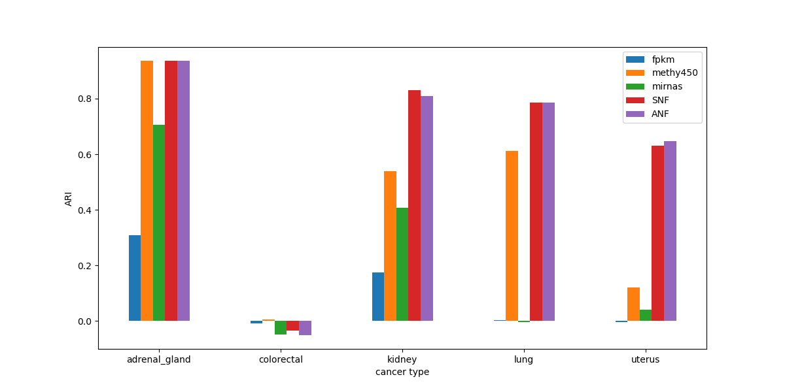
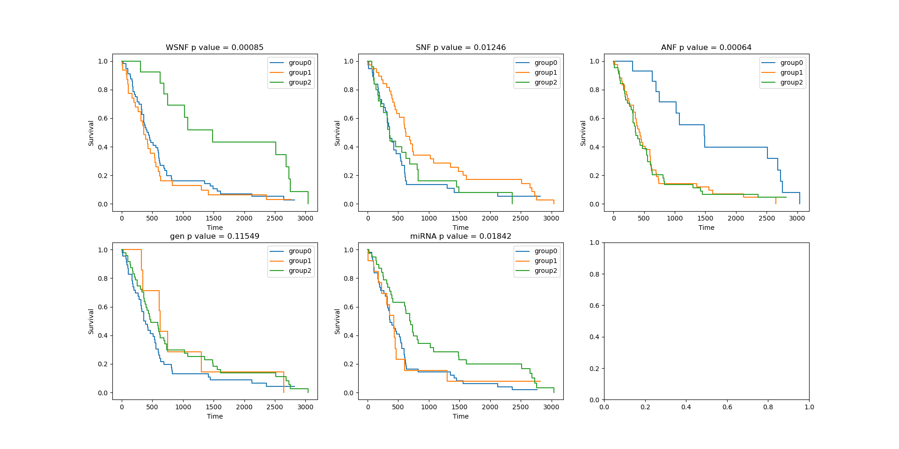
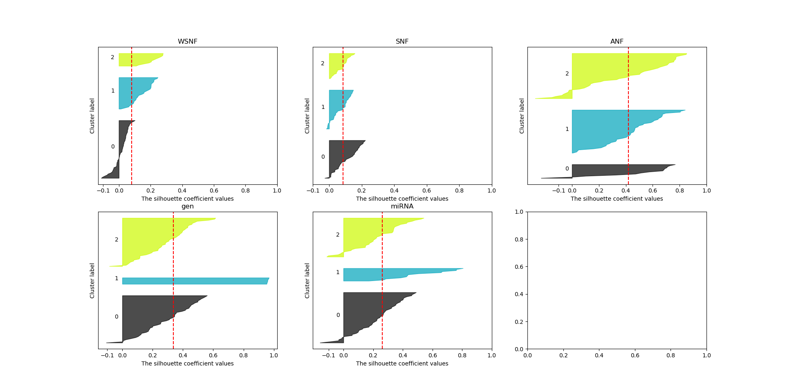

# Similarity Network Fusion
---
## Background
#### Overall
  - multiple and diverse **genome-scale data**
  - **integrative methods** are essential for capture biological information
  - identification of homogeneous **subtypes** in one cancer
#### Integrative challenge
 
 - the small number of **samples** compared to the large number of measurements.
 - the **differences** in scale, collection bias and noise in each data set
 - the **complementary nature** of the information provided by different types of data

#### Former methods
- **concatenate** normalized measurements
      *low signal-noise ratio*
- analyze each data type **independently** before combining
      *hard to integrate*
- **preselect** important genes and use Consensus Clustering
      *biased analysis*

## SNF
#### Main steps
- **construct** a sample-similarity network for each data type
- **integrate** these networks into a single similarity network using a nonlinear combination method

#### Advantages
- capture both **shared** and **complementary** information, offered insight into how informative each data type is to the observed similarity
- derive useful information from a **small** number of samples
- **robust** to noise, data heterogeneity and scales to a large number of genes
- make **efficient** identifies of subtypes among existing samples by clustering and predict labels for new samples
#### Details
- A **patient similarity network** is represented as a graph $G=(V,E)$  
  - $V = \{x_1, x_2, x_3, ..., x_n\}$ correspond to the patients  
  - $E$ similarity between patients
  - $W$ is the similarity matrix
  $$
  \begin{aligned}
  \rho(x_i, x_j) &= Euclidean \space distance \space  between \space  x_i \space and \space x_j  \\
  \epsilon_{i,j} &= \frac{mean(\rho(x_i, N_i)) + mean(\rho(x_j, N_j))+\rho(x_i, x_j)}{3} \\
  W(i, j) &= exp(-\frac{\rho^2(x_i,x_j)}{\mu\epsilon_{i,j}})
  \end{aligned}
  $$
- Define a full and sparse **kernel** to normalize weighted matrix on the vertex $V$
  - full kernel is a normalized weight matrix $P$
  $$
  \begin{aligned}
   P &= D^{-1}W \\
   D(i, i) &= \sum_{j}W(i,j) \\
   \sum_{j}P(i,j) &= 1
  \end{aligned}
  $$
  - a little modification to eliminate self-similarities
  $$
  \begin{aligned}
   P(i,j) &= \begin{cases}
   \frac{W(i,j)}{2\sum_{k\not ={i}}{W(i, k)}}, \small{j\not ={i}} \\
   \frac{1}{2}, \small{j=i}
   \end{cases}   
  \end{aligned}
  $$
- use KNN to measure local **affinity** (set non-neighboring points to 0)
  $$
  S(i,j) = \begin{cases}
  \frac{W(i,j)}{\sum_{k\in{N_i}W(i,k)}}, \small{j\in{N_i}} \\
  0, \small{otherwise}
  \end{cases}
  $$
- iteratively **update** similarity matrix corresponding to each of the data types
  $$
  \begin{aligned}
  \textbf{P}^{(v)} = \textbf{S}^{(v)} \times \Big(\frac{\sum_{k\not ={v}}\textbf{P}^{(k)}}{m-1}\Big) \times (\textbf{S}^{(v)})^{T} 
  \end{aligned}
  $$
- example: two data types
  $$
  \textbf{P}^{(1)}_{t+1} = \sum_{k\in N_i} \sum_{l \in N_j} \textbf{S}^{(l)}(i,k) \times \textbf{S}^{(l)}(j,l) \times \textbf{P}^{(2)}_{t}(k,l)
  $$
  - similarity information is only propagated through the common neighborhood
  - comlementary information from other data type

## WSNF
#### Background
- Existing methods rarely use information from gene regulatory networks to facilitate the subtype identification. In other words, the information among features is ignored.
#### Main steps
- Construct the regulatory network
  
- Calculate feature weights
- Weighted similarity network fusion
#### Advantage
- Make use of both the expression data and network information. Take the feature weight into consideration, so perform better than SNF.
#### Details
- Compute ranking of features using Google PageRank  
  Network is defined as $G(V, E)$. The nodes $V$ are the features, and the edges $E$ are the interactions. The direciton of an edge is from a regulator to its target.
  $$
  \begin{aligned}
  &N features = \{f_1, f_2, ..., f_N\} \\
  &R(f_i) = \frac{1-d}{N} + d \sum_{f_j \in T(f_i)} \frac{R(f_j)}{L(f_j)} \\
  &d \space is \space damping \space factor \\
  &L(f_j) \space is \space the \space number \space of \space regulators \space which \space regulate \space f_j
  \end{aligned}
  $$
  Normalize the ranks as:
  $$
  R_N(f_i) = \frac{R(f_i)}{\sum_{m=1}^{N}R(f_m)}
  $$
- Integrate feature ranking and feature variantion
  - Higher expression variations are always treated as more important biological marker in cancer mechanisms.  
  - $X(f_i)$ is a numeric vector representing the expression value of feature $f_i$ across all samples
  The MAD(median absolute deviation) of a feature $f_i$ is calculated as:
  $$
  MAD(f_i) = median(|X(f_i) - median(X(f_i))|)
  $$  
  Normalize the MADs as:
  $$
  MAD_N(f_i) = \frac{MAD(f_i)}{\sum_{m=1}^{N}MAD(f_m)}
  $$
  - Apply a linear model to integrate these two measures to get the final weight
    $$
    W(f_i) = \beta R_N(f_i) + (1-\beta)MAD_N(f_i)
    $$
- Weighted similarity network fusion
  $$
  Distance(S_i, S_j) = \sqrt{\sum_{m=1}^{P}W(f_m) * (f_m^{S_i}-f_m^{S_j})^2} \space \forall i,j \le n, i\not = j
  $$
- Execute SNF algorithm

## ANF

#### Main steps

- Construct affinity network in n views 
  $$
  W^{(1)}, W^{(2)},...,W^{(n)}
  $$
- Fuse the affinity networks
  $$
  W^{(1)}, W^{(2)},...,W^{(n)} \Rightarrow W
  $$
- Apply spectral clustering on $W$

#### Details
- Step 1: construct affinity networks 
  Input: patient-feature matrices $X^{(1)}, X^{(2)},...,X^{(n)}$, $N$ patients, $n$ views
  - Pair-wise Euclidean distance
  $$
  \delta_{ij}^{(v)} : \text{Euclidean distance between patient i and patient j in view v}
  $$
  - Apply KNN Gaussian kernel
  $$
  K_{ij} = \frac{1}{\sqrt{2\pi}\sigma _{ij}}e^{-\frac{\delta_{ij}^2}{2\sigma_{ij}^2}}
  $$
  - Row normalization
  $$
  S_{ij}^{(v)}=\frac{K_{ij}^{(v)}}{\sum_{j=1}^NK_{ij}^{(v)}}
  $$
  - KNN pruning
  $N_k(i)$: $k$-nearest neighbors of patient $i$
  $$
  W_{ij}^{(v)}=
  \begin{cases}
  \frac{S_{ij}^{(v)}}{\sum_{j\in N_k(i)}S_{ij}^{(v)}}, &\text{if } j\in N_k(i)\\
  0, &\text{otherwise}
  \end{cases}
  $$
- Step 2: affinity network fusion
  - Complementary view of $W^{(v)}$
  $$
  \overline{W^{(-v)}}=\frac{1}{n-1}\sum_{i\ne v}W^{(i)}
  $$
  - 2-step random walk
  $$
  W^{(v)} = \frac{W^{(v)}\cdot \overline{W^{(-v)}} + \overline{W^{(-v)}}\cdot W^{(v)}}{2}
  $$
  - Weighted sum (uniform weights by default)
  $$
  W=\frac{1}{n}\sum_{v=1}^nW^{(v)}
  $$
  - Intuition
    - Similarity graph can be regarded as a state transition matrix, where    the similarity between patient i and j is the probability of state i transitions to patient j.

    - Multiplying two similarity matrix is a 2-step random walk on the transition graphs.

#### Machine learning on affinity networks
  - Neural network model
  
  - Learn weights $w_1,w_2,...,w_n$ of different views.
  - Advantages
    - Learn from either ground-truth labels or clustering labels generated by ANF (so-called semi-supervised learning).
    - Few-shot learning.
    - 96% accuracy on some datasets.

## Results
#### Evaluation methods
- Labeled data: NMI, ARI, RI, etc.
- UnLabeled data
  - Survival analysis
  Different cancer subtypes should have different survival curves.
  Log-rank test measures whether two survival curves are different, in the form of p value.
  Implementation: [lifelines](https://lifelines.readthedocs.io/en/latest/)
  - Silhouette score
    Silhouette score measures how similar an object is to its own cluster compared to other clusters. Higher silhouette score means better cohesion. If someone's silhouette score falls below zero, it would be more appropriate if he was clustered in the neighboring cluster.
    For sample $i$, its silhouette score $s(i)$ is calculated as follows:
    $$
    \text{let patient }i\text{ belong to cluster }A,\\
    C\ne A\text{ is the closest cluster to }i,\\
    a(i) = \text{average similarity of i to all other objects of A}\\
    b(i) = \text{average similarity of i to all objects of C}\\
    s(i) = \frac{a(i)-b(i)}{max\{a(i),b(i)\}}
    $$
    The silhouette score of a clustering result is the average of all samples.

#### Performance
- Labeled datasets:
  Gene, methylation and miRNA data of five cancer types, from [HarmonizedTCGAData](https://github.com/BeautyOfWeb/HarmonizedTCGAData)
  
  
  
  Graph fusion methods (SNF and ANF) get better results than single view based clustering. The performance of SNF and ANF are quite similar.
  WSNF is not included because these datasets lack interaction data between features, which are nessesary for WSNF.
- Unlabeled datasets: GBM dataset
  - Survival analysis
    
    Both WSNF and ANF find out a subtype of a relatively high survival rate. They also get very small p-values. SNF failed to do the job.
  - Silhouette score
    
    Two of the three papers used silhouette score as their metircs. However, we think silhouette score only evaluates CLUSTERING methods (kNN clustering, spectral clustering, etc.), rather than GRAPH FUSION methods.  Silhouette score is based on intra-cluster and inter-cluster similarities, but different fusion methods get different similarity graphs!  

## Appendix
Code: [Github](https://github.com/yik-cyber/SNFtool)
You can reproduce our results by running ``evaluate_on_labeled_data.py``, ``evaluate_on_unlabeled_data.py`` and ``ANF_net_test.ipynb``.

分工：
SNF：向红静、马圣杰
WSNF：向红静
ANF：马圣杰